# 兒童注意力監測系統 - 設計規格書

# Attention Assessment System - Design Specification

**專案名稱**：Attention Assessment System for ASD and TD Children  
**版本**：2.0  
**最後更新**：2026 年 6 月  
**文件作者**：專題團隊（B1109240 劉立綸、B1229011 李瑋恆、B1229056 黃昱翔、B1229059 黃璿軒）

github:[https://github.com/Aliulilun/Attention-Assessment-System.git](https://github.com/Aliulilun/Attention-Assessment-System.git)

---

## 目錄 (Table of Contents)

1. [系統架構圖](#1-系統架構圖)
2. [使用案例圖](#2-使用案例圖)
3. [循序圖](#3-循序圖)
  - 3.1 [整合系統完整流程](#31-整合系統完整流程)
  - 3.2 [視線估計五階段流程](#32-視線估計五階段流程)
4. [活動圖](#4-活動圖)
  - 4.1 [以 Stage 為單位的分析流程](#41-以-stage-為單位的分析流程)
  - 4.2 [Ray Casting 注意力判定演算法](#42-ray-casting-注意力判定演算法)
  - 4.3 [語音觸發時間窗機制](#43-語音觸發時間窗機制)
5. [類別圖](#5-類別圖)
6. [狀態圖](#6-狀態圖)
  - 6.1 [題目偵測狀態機（EasyOCR）](#61-題目偵測狀態機easyocr)
  - 6.2 [時間窗狀態轉換](#62-時間窗狀態轉換)
7. [部署圖](#7-部署圖)

---

## 1. 系統架構圖

### 說明

本圖展示整合後系統的三層架構，以及四個核心功能模組（`stage`、`speech`、`point`、`eye_tracking`）的資料流向。系統輸入單一實驗影片，連續偵測題目進度（Stage 1~8），對每個題目分別進行視線與手勢分析，最終輸出各題目的注意力判定結果。

### 架構圖 (Component Diagram)

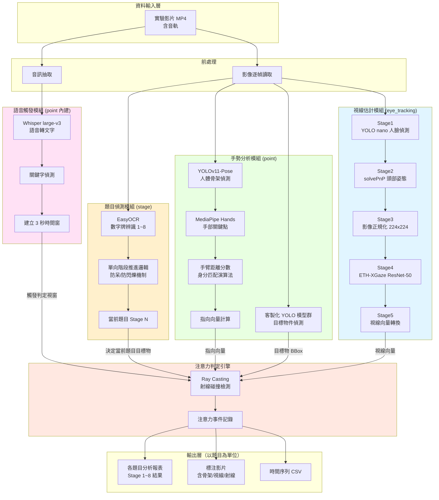

### 關鍵技術說明

| 模組                  | 核心技術                           | 功能                  |
| ------------------- | ------------------------------ | ------------------- |
| 題目偵測 (stage)        | EasyOCR + 單向推進邏輯               | 辨識數字牌 1~8，追蹤當前題目    |
| 語音觸發 (point)        | Whisper large-v3               | 關鍵字偵測，建立 3 秒判定時間窗   |
| 手勢分析 (point)        | YOLOv11-Pose + MediaPipe Hands | 骨架偵測、手部關鍵點、指向向量     |
| 視線估計 (eye_tracking) | ETH-XGaze ResNet-50            | 5 階段視線方向估計，輸出 3D 向量 |
| 注意力判定               | Ray Casting + Greedy Matching  | 空間碰撞判定，計算各題目命中率     |

---

## 2. 使用案例圖

### 說明

展示系統的主要使用者（研究人員、臨床醫師、系統管理員）以及核心功能，強調系統以「各題目（Stage 1~8）分析結果」為最終輸出。

### 使用案例圖 (Use Case Diagram)

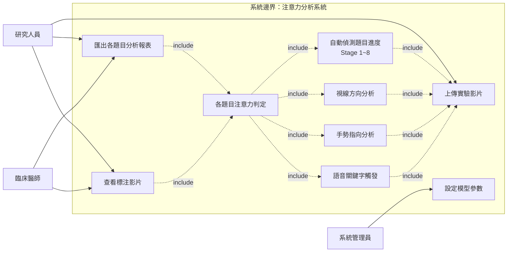

### 使用案例說明

| 使用案例           | 描述                            | 主要角色      |
| -------------- | ----------------------------- | --------- |
| UC1: 上傳實驗影片    | 輸入含音軌的實驗影片 (MP4)              | 研究人員      |
| UC2: 自動偵測題目進度  | EasyOCR 辨識數字牌，自動推進 Stage 1~8  | 系統自動      |
| UC3: 視線方向分析    | eye_tracking 5 階段流程，輸出視線向量    | 系統自動      |
| UC4: 手勢指向分析    | point 模組偵測骨架、手部、指向向量          | 系統自動      |
| UC5: 語音關鍵字觸發   | Whisper 偵測關鍵字，建立 3 秒時間窗       | 系統自動      |
| UC6: 各題目注意力判定  | Ray Casting 判定每個 Stage 的注意力命中 | 系統自動      |
| UC7: 匯出各題目分析報表 | 輸出 Stage 1~8 命中率統計與 CSV       | 研究人員、臨床醫師 |
| UC8: 查看標注影片    | 觀看含視線箭頭、手勢向量、Stage 標籤的影片      | 研究人員、臨床醫師 |
| UC9: 設定模型參數    | 調整 YOLO 閾值、時間窗長度等             | 系統管理員     |

---

## 3. 循序圖

### 3.1 整合系統完整流程

#### 說明

展示從影片輸入到各題目結果輸出的完整互動時序，包含題目偵測、語音觸發、視線估計、手勢偵測與注意力判定的協作關係。

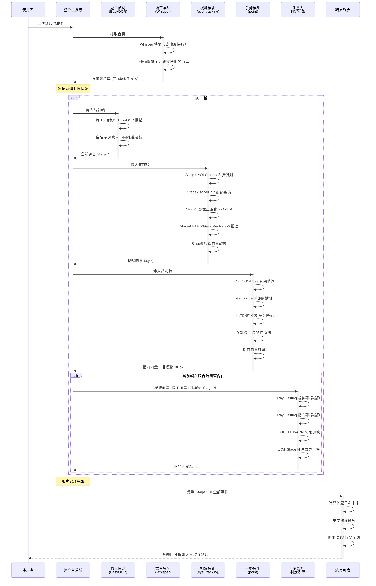

---

### 3.2 視線估計五階段流程

#### 說明

詳細展示 `eye_tracking` 模組五個處理階段的順序互動與資料轉換過程。

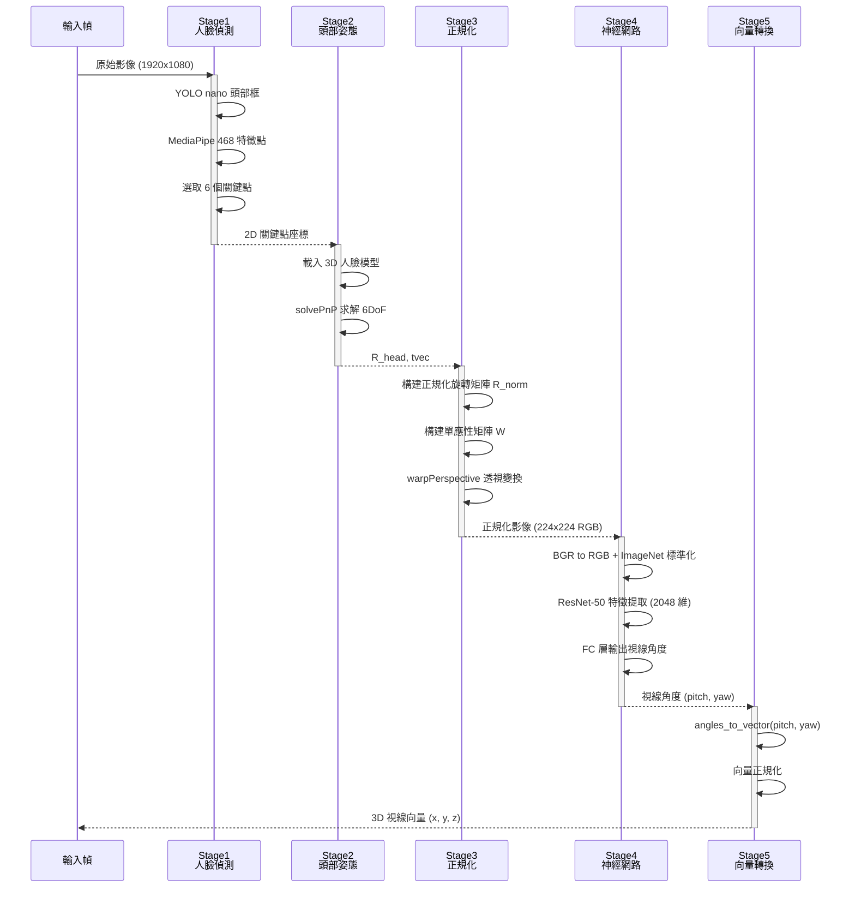

#### 階段資料轉換說明

| 階段      | 輸入               | 核心演算法                 | 輸出                    |
| ------- | ---------------- | --------------------- | --------------------- |
| Stage 1 | 原始影像 (1920×1080) | YOLO nano + MediaPipe | 6 個 2D 關鍵點            |
| Stage 2 | 2D 關鍵點 + 3D 模型   | OpenCV solvePnP       | 旋轉矩陣 R_head、平移向量 tvec |
| Stage 3 | R_head, tvec     | warpPerspective       | 正規化影像 (224×224)       |
| Stage 4 | 正規化影像            | ResNet-50             | 視線角度 (pitch, yaw)     |
| Stage 5 | 視線角度             | 三角函數轉換                | 3D 單位向量 (x, y, z)     |

---

## 4. 活動圖

### 4.1 以 Stage 為單位的分析流程

#### 說明

展示系統以題目（Stage 1~8）為分析單位的完整處理流程，包含 EasyOCR 題目偵測、語音時間窗觸發、視線與手勢並行分析、以及各題目結果彙整輸出。

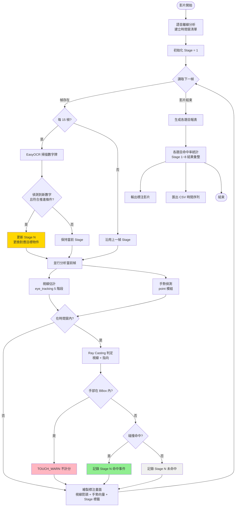

---

### 4.2 Ray Casting 注意力判定演算法

#### 說明

展示系統如何以射線投射（Ray Casting）判定受試者是否將注意力（視線或手勢）導向當前題目（Stage N）的目標物，以及防呆機制（TOUCH_WARN）的運作。

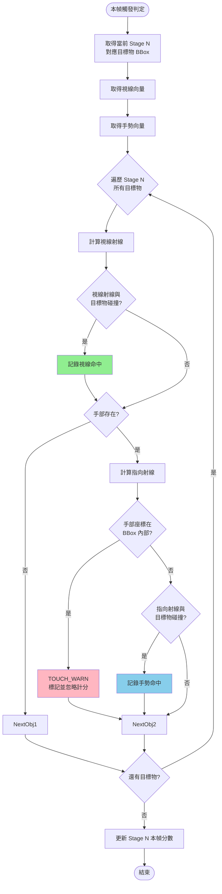

---

### 4.3 語音觸發時間窗機制

#### 說明

展示系統如何使用 Whisper 進行語音辨識、偵測關鍵字並建立動態判定時間窗，以及快取機制降低重複運算成本的完整流程。

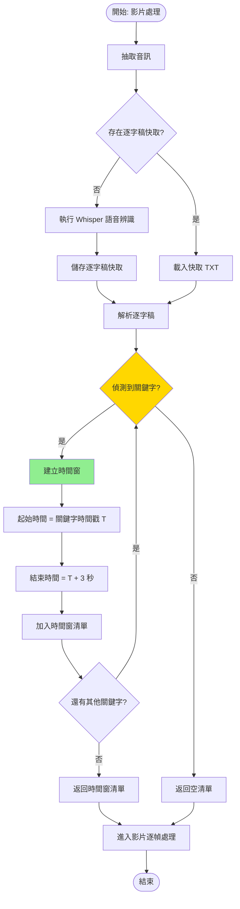

---

## 5. 類別圖

### 說明

展示整合系統的核心類別結構，包含新增的 `StageDetector`（EasyOCR 題目偵測）與 `ReportRecorder`（各題目結果紀錄）。

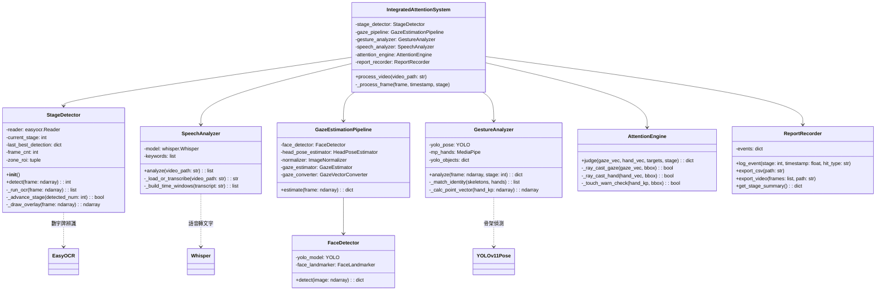

---

## 6. 狀態圖

### 6.1 題目偵測狀態機（EasyOCR）

#### 說明

展示 `stage` 模組如何透過 EasyOCR 辨識數字牌，以單向防呆邏輯推進題目（Stage 1~8），同時每個 Stage 皆並行進行視線與手勢分析。

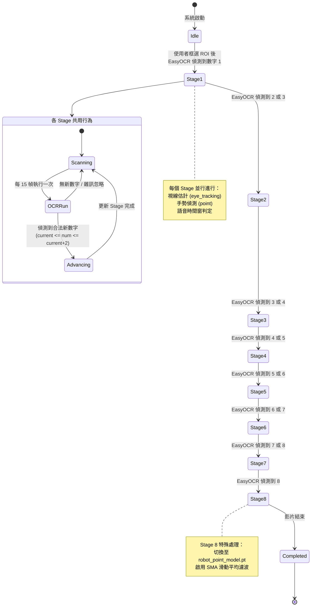

### 狀態轉換規則

| 狀態                  | 觸發條件                      | 說明           |
| ------------------- | ------------------------- | ------------ |
| Idle → Stage1       | 使用者框選 ROI，EasyOCR 偵測到 1   | 初始化          |
| Stage N → Stage N+1 | EasyOCR 偵測到 N+1 或 N+2 的數字 | 單向推進，最多跳 2 級 |
| 任何 Stage            | 偵測到超出範圍或回退數字              | 視為雜訊，忽略      |
| Stage 8 → Completed | 影片結束                      | 彙整輸出         |

---

### 6.2 時間窗狀態轉換

#### 說明

展示語音關鍵字觸發後，3 秒高靈敏判定時間窗的狀態轉換過程。

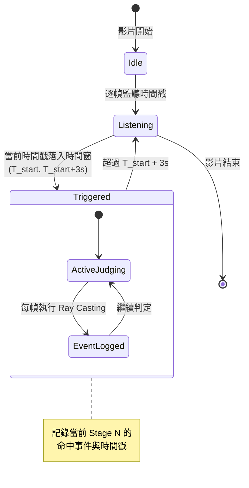

---

## 7. 部署圖

### 說明

展示整合後系統在統一環境下的部署架構，目標是將 `point` 與 `eye_tracking` 合併至單一 Conda 環境。

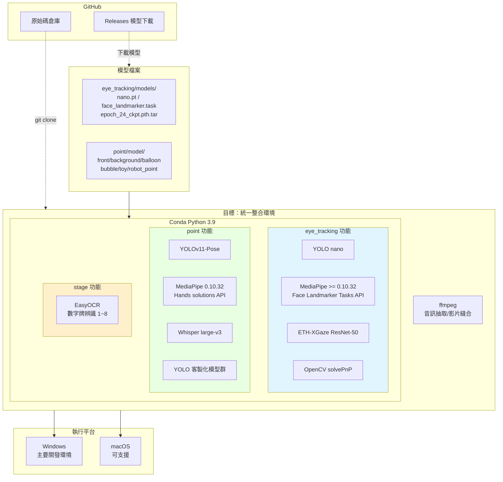

### 部署環境需求（整合後）

| 項目          | 規格                           |
| ----------- | ---------------------------- |
| Python      | 3.9                          |
| 套件管理        | Conda (Anaconda / Miniconda) |
| 作業系統        | Windows（主要）/ macOS（可支援）      |
| MediaPipe   | 0.10.32（統一版本）                |
| PyTorch     | 2.8.0                        |
| Ultralytics | 8.4.19                       |
| 系統工具        | ffmpeg                       |

---

## 附錄 A：技術堆疊總覽

| 類別   | 套件               | 版本       | 用途            |
| ---- | ---------------- | -------- | ------------- |
| 深度學習 | PyTorch          | 2.8.0    | 神經網路推理        |
| 深度學習 | TorchVision      | 0.23.0   | ResNet-50 載入  |
| 電腦視覺 | OpenCV           | 4.13.0   | 影像處理、solvePnP |
| 電腦視覺 | MediaPipe        | 0.10.32  | 人臉 + 手部偵測     |
| 目標偵測 | Ultralytics YOLO | 8.4.19   | 人體骨架 + 物件偵測   |
| 字元辨識 | EasyOCR          | 1.7.2    | 數字牌辨識         |
| 語音處理 | OpenAI Whisper   | large-v3 | 語音轉文字         |
| 影片處理 | FFmpeg           | 系統版      | 音訊抽取 + 影片縫合   |
| 影片處理 | MoviePy          | 2.2.1    | 影片編輯          |
| 資料處理 | NumPy            | 2.0.2    | 矩陣運算          |
| 資料處理 | Pandas           | 2.3.3    | CSV 與時間序列     |

---

## 附錄 B：關鍵演算法參考

### Ray Casting（射線投射）

- **應用場景**：3D 視線向量與 2D 邊界框的碰撞檢測

### Greedy Bipartite Matching（貪婪二分圖匹配）

- **應用場景**：解決雙手交錯時的身分識別問題

### PnP (Perspective-n-Point)

- **實作**：`cv2.solvePnP(SOLVEPNP_ITERATIVE)`
- **應用場景**：從 6 個 2D 特徵點與 3D 模型求解 6DoF 頭部姿態

### SMA (Simple Moving Average)

- **公式**：`MA(t) = (x[t] + ... + x[t-n+1]) / n`
- **應用場景**：Stage 8 機器人指向座標的雜訊過濾

### EasyOCR 單向推進邏輯

- **白名單**：只辨識 `1~8` 的數字
- **推進條件**：`current_stage <= detected_num <= current_stage + 2`
- **防呆**：偵測到回退或超範圍數字時視為雜訊忽略

---

## 附錄 C：文件版本歷史

| 版本  | 日期         | 作者   | 變更摘要                                    |
| --- | ---------- | ---- | --------------------------------------- |
| 1.0 | 2026/06/02 | 專題團隊 | 初版發布                                    |
| 2.0 | 2026/06/07 | 專題團隊 | 修正 UML 圖，反映 EasyOCR stage 偵測、整合架構與各題目輸出 |

---

*本文件使用 Mermaid 語法生成 UML 圖表，可直接在 GitHub 或支援 Mermaid 的 Markdown 編輯器中渲染。*